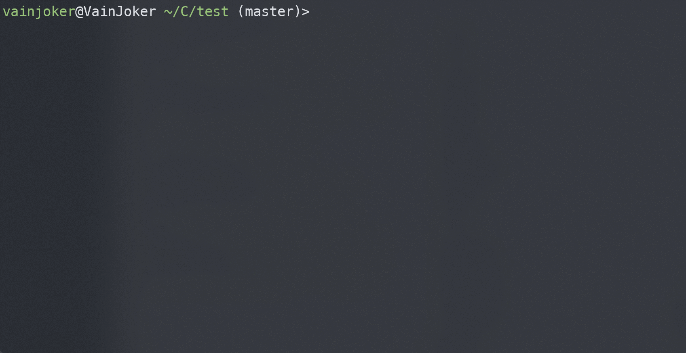

<!-- PROJECT LOGO -->
<br />
<div align="center">
  <a href="https://github.com/vainjoker/revise">
    
  </a>

<h3 align="center">Revise</h3>

  <p align="center">
    Interactive CLI that generate standardized git commit messages
    <br />
    <br />
    <a href="https://github.com/vainjoker/revise">Explore the docs</a>
    ·
    <a href="https://github.com/vainjoker/revise/issues">Report Bug</a>
    ·
    <a href="https://github.com/vainjoker/revise/issues">Request Feature</a>
  </p>
</div>


<!-- TABLE OF CONTENTS -->
<details>
  <summary>Overview</summary>
  <ol>
    <li>
      <a href="#about-the-project">About The Project</a>
    </li>
    <li>
      <a href="#getting-started">Getting Started</a>
      <ul>
        <li><a href="#example">Example</a></li>
        <li><a href="#prerequisites">Prerequisites</a></li>
        <li><a href="#installation">Installation</a></li>
      </ul>
    </li>
    <li><a href="#usage">Usage</a></li>
    <li><a href="#roadmap">Roadmap</a></li>
    <li><a href="#license">License</a></li>
  </ol>
</details>

<!-- ABOUT THE PROJECT -->
## About The Project

>Revise is an interactive command-line interface (CLI) tool that generates standardized git commit messages. It allows you to amend and enhance your commit messages, making them more informative and clear.




<!-- GETTING STARTED -->
## Getting Started

### Example
To use git-revise, you have the option to create a toml file called *`revise.toml`* in the project directory or your local config directory. This file allows you to customize the configuration settings for git-revise. However, it's important to note that you can still use git-revise without creating these files, as it will use the default configuration.

For example, you can configure git-revise by creating a revise.toml file with the following content:
```
types = [
    { key= "feat", value= "A new feature"},
    { key= "fix", value= "A bug fix"},
    { key= "docs", value= "Documentation only changes"},
    { key= "style", value= "Changes that do not affect the meaning of the code"},
    { key= "refactor", value= "A code change that neither fixes a bug nor adds a feature"},
    { key= "perf", value= "A code change that improves performance"},
    { key= "test", value= "Adding missing tests or correcting existing tests"},
    { key= "build", value= "Changes that affect the build system or external dependencies"},
    { key= "ci", value= "Changes to our CI configuration files and scripts"},
    { key= "chore", value= "Other changes that don't modify src or test files"},
    { key= "revert", value= "Reverts a previous commit"}
]

emojis = [
    { key= "feat", value="✨"},
    { key= "fix", value="🐛"},
    { key= "docs", value="📚"},
    { key= "style", value="🎨"},
    { key= "refactor", value="♻️"},
    { key= "perf", value="⚡️"},
    { key= "test", value="✅"},
    { key= "build", value="📦️"},
    { key= "ci", value="🪶"},
    { key= "chore", value="🔨"},
    { key= "revert", value="◀️"}
]

api_key.gemini_key = "{{env}}"

scopes = [
    "revise",
    "config",
    "test",
    "docs"
]

exclude_files = [
    "CHANGELOG.md"
]

template = """
{{commit_icon}} {{ commit_type }}({{commit_scope}}){{commit_breaking_symbol}}: {{ commit_subject }}({{commit_issue}})   
\n{{ commit_body }}
\n{{ commit_breaking }}
"""

[translation]
from = "中文"
to = "English"

[auto]
[auto.git]
add = false
push = false
diff = false
footer = false
[auto.commit]
content = false
footer = false

[hooks]
pre-add = [
    { command = "cargo clippy --fix --allow-dirty --allow-staged", order = 1 },
    { command = "cargo make", order = 2 },
]
post-add = [
    { command = "git status", order = 1 },
]
pre-commit = [
]
post-commit = [
]

```

### Prerequisites

This is an example of how to list things you need to use the software and how to install them.
* git
* gemini-api-key

### Installation
In order to install, just run the following command

```sh
cargo install --force git-revise
```

This will install git-revise in your `~/.cargo/bin`.<br>
Make sure to add `~/.cargo/bin` directory to your `PATH` variable.<br>
<br>

<!-- USAGE EXAMPLES -->
## Usage

You can use it simply type
```sh
git revise
```
or

```sh
git-revise
```


<!-- ROADMAP -->
## Roadmap

- [x] Auto add and show diff
- [x] AI integrated
    - [x] Auto translate to english
    - [x] Auto generate with git diff
- [ ] More configurable

See the [open issues](https://github.com/vainjoker/revise/issues) for a full list of proposed features (and known issues).


<!-- LICENSE -->
## License

Distributed under the GPL-3.0 License. See `LICENSE` for more information.